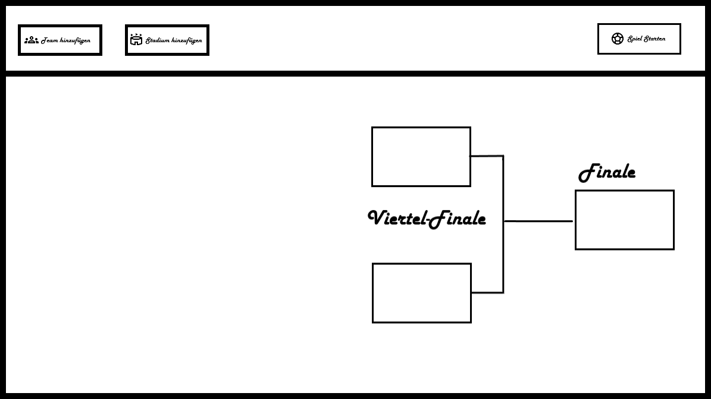
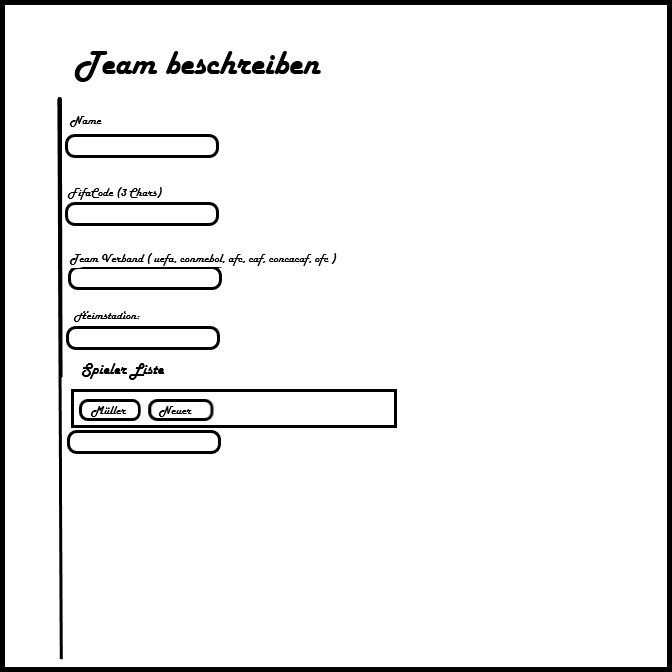

# WM-Simulator


Der WM-Simulator soll mit hilfe von VCL und einem "Backend" aus CSV-Datein eine einfache Weltmeisterschaft mit Teams und Stadien simulieren.


## Design
### Hauptfenster



### Team hinzufügen - Fenster



### Fonts

#### Font-Face
Harlow Solid

#### Größe
Buttons - 9px
H1 - 26px
H2 - 12px


## Types

```Pascal

type TTeamRanking = (SehrStark = 4, Stark = 3, MittelStark = 2, Schwach = 1);
type TTeamVerband = (UEFA, CONMEBOL, AFC, CAF, CONCACAF, OFC);

type TTeam = record
    Name: String;
    FIFACode: Char[3];
    TeamVerband: TTeamVerband;
    HistorischeWMSiege: Byte;
    Heimstadion: TStadion; // in der Simulation vielleicht +5% Siegchancen
    Flagge: Byte; // als index für eine TImageList
    FSpielerListe: array[0..11] of String; // Nur Namen
    TeamRanking: TTeamRanking;

    // ↓ für spätere Statistiken - keine Stammdaten
    private
        ToreGeschossen: Byte;
        ToreKassiert: Byte;
        Siege: Byte;
        Unentschieden: Byte;
        Niederlagen: Byte;
end;

type TStadion = record
    Ort: String; // z.B. "Allianz Arena"
    ZuschauerKapazität: UInt32; // Zuschauer Zahl kann größer als WordMax 65'535 sein
    Zuschauer: UInt32; // " - für die Simulation wenn >90% Kapazität, +5% Siegchancen wenn Heimstadion
end;

type TSpiel = record
    Team1: TTeam;
    Team1Spielstand: Byte; // kein Spiel wird über 255 gehen
    Team2: TTeam;
    Team2Spielstand: Byte; // "

    AustragunsDatum: TDate;

    Stadion: TStadion;
end;

type TWMState = class
    Teams: array[0..47] of TTeam;       // 48 Teams in 2026
    Stadien: array[0..15] of TStadion;  // 16 Stadien in 2026
end;
```


## Struktur

### Daten-Auslese
Bei Start des Programs wird geschaut, ob etwas in der Datenbank ist, und basiered darauf wird der "Spiel Starten" Button überhaupt erst freigeschaltet. Bedeutet es braucht eine `src/ui/main.pas -> FormCreate` funktion und eine `src/db/get?.pas` mit return Boolean, welches true oder false basierend auf der Datenlage zurückgibt.

Um Modular und Erweiterbar zu bleiben, wird es keine "hard-coded" Add und Set Funktionen geben, sondern es wird alles über eine SQL-ähnliche Tabellen Struktur gespeichert, verändert und ausgelesen.

Darauf basierend liegt das `src/simulation` Layer welches diese Tabellen namen "imodular" benutzt und 

`src/utils/*.pas` soll zentralisiert oft verwendete Funktionen haben.


## Datenbank

Fürs erste wird alles in CSV-Datein mit `;` Trennzeichen getrennt.
Als Mechanismus des Findens ist das Namensschema `custom_database_{*Name der Tabelle*}.csv` zu beachten.
Um auch bei dem Namensschema flexibel zu bleiben wird es in `src/utils/db/naming.pas` eine `ChangeFileExt` inspirierte Funktion geben, welche dieses Schema populiert.


## Aktuelle Datei-Struktur

```
C:.
|   .gitignore
|   README.md
|   temp.txt
|   
+---assets
|   |   design-hauptfenster.png
|   |   design-teamfenster.png
|   |   
|   \---icons
|           add.png
|           Gruppen.png
|           sports_soccer.png
|           Stadion.png
|           
+---bin
\---src
    |   Main.dfm
    |   Main.pas
    |   WMSimulator.dpr
    |   WMSimulator.dproj
    |   WMSimulator.dproj.local
    |   
    +---db
    +---simulation
    +---types
    +---ui
    |       Main.dfm
    |       Main.pas
    |       
    \---utils
        +---db
        |       Utils.DB.Naming.pas
        |       
        \---fixed_arrays
                Utils.FixedArrays.pas
```


### src/ui/*

Hier soll ausschließlich Code für Nutzer Eingaben und die wirkliche UI liegen.
Bei einem TEdit darf allein die Eingabe abgefragt, überprüft und weitergegeben werden.


## Mögliche Verbesserungen

- Ein universelles Modal Form (an stelle von StadionEingabeFenster oder TeamEingabeFenster) mit modularem Rendering
    - Rtti input validation

↓ ModularForm.Create
-→ TModularForm<T>.Create(TableName: String) // dynamic rendering with Rtti aware looping Length(RttiFields)

↓ UserInputValidation
-→ case RttiField.FieldType.TypeKind
    tkInteger: -> TryStrToInt